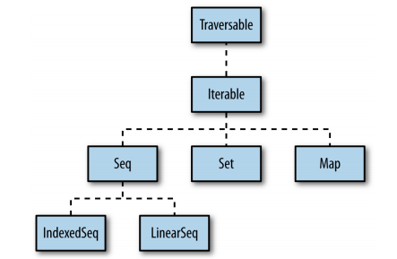
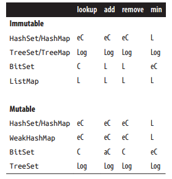

### Chapter 1. Strings

#### Introduction
**Main**
```
字符串遍历、截取等操作
map foreach filter drop take capitalize
```

#### 1.1. Testing String Equality（比较字符串是否相等）
**TestStringEqual**
```
toUpperCase
equalsIgnoreCase
```

#### 1.2. Creating Multiline Strings（创建多行字符串）
**CreateMullineString**
```
stripMargin
replaceAll
```


#### 1.3. Splitting Strings（分割字符串）
**SplitString**
```
split
trim
```

#### 1.4. Substituting Variables into Strings（将变量插入到字符串里）
**VariableToString**
```
s
f
raw
```
#### 1.5. Processing a String One Character at a Time(一次处理字符串的一个字符)
**StringOneCharOneTime**
```
toUpper
toByte
toChar
```


#### 1.6. Finding Patterns in Strings（找到符合条件的匹配）
**PatternString**
```
r
findFirstIn
findAllIn
```

#### 1.7. Replacing Patterns in Strings（将匹配结果进行替换）
**ReplacePatternString**
```
replaceAll
replaceAllIn
replaceFirst
replaceFirstIn
```

#### 1.8. Extracting Parts of a String That Match Patterns
**OtherPartPatternString**
```
the regex groups
```

#### 1.9. Accessing a Character in a String（访问字符串的某个字符）
**AccessCharFromString**
```
charAt
apply
```

#### 1.10. Add Your Own Methods to the String Class（增加自己的方法在String类中）
**AddOwnMethodInString**
```
在object中加入隐式类
在package object中加入隐式类
```
**AddOwnMethodInString2（版本2.10之前的使用方式）**
```
在class中定义自己的方法，然后定义另外一个方法处理隐式转换。
```
**AddOwnMethodInStringTalk**
```
隐式转换有返回类型
```
### Chapter 2. Numbers

#### Introduction
**Main**
```
nscala_time
```

#### 2.1. Parsing a Number from a String（将字符串转换成数值）
**ParseNumFromString**
```
toInt
toDouble
toFloat
toLong
toShort
toByte
getOrElse
Integer.parseInt
```

#### 2.2. Converting Between Numeric Types (Casting)（数值类型之间的转换）
**ConvertNumType**
```
isValidByte
isValidShort
```

#### 2.3. Overriding the Default Numeric Type（改变默认的数值类型）
**OverrideDefaultNum**
```
general case
var [name]:[Type] = [initial value]
```

#### 2.4. Replacements for ++ and −−
**ReplacementsPlusMinus**
```
Scala中并没有提供++和--运算符
```

#### 2.5. Comparing Floating-Point Numbers（比较浮点数）
**CompareFloatPointNum**
```
自定义约等于 ~= 方法
```

#### 2.6. Handling Very Large Numbers（处理大数）
**HandleLargeNum**
```
BigInt
BigDecimal
toLong
isValidByte
PositiveInfinity    正无穷大
NegativeInfinity    负无穷大
```

#### 2.7. Generating Random Numbers（生成随机数）
**GenerateRandomNum**
```
scala.util.Random
nextInt
nextDouble
nextPrintableChar
```

#### 2.8. Creating a Range, List, or Array of Numbers
**CreateRangeListArray**
```
1 to 10 by 2
1 to 5
1 until 5
toArray
toList
```

#### 2.9. Formatting Numbers and Currency（格式化数值和控制小数点位置）
**FormatNumAndCurrency**
```
scala.math.Pi
java.text.NumberFormat.getIntegerInstance（增加逗号）
```

### CHAPTER 3 Control Structures

#### Introduction
**Main**
```
capitalize（首字母大写）
```

#### 3.1. Looping with for and foreach（循环）
**LoopWithForAndForeach**
```
Array
toUpperCase
zipWithIndex
```

#### 3.2. Using for Loops with Multiple Counters（多个计数器的循环）
**LoopWithMultipleCounter**
```
Array.ofDim
```

#### 3.3. Using a for Loop with Embedded if Statements(Guards)（for循环里面嵌入if语句）
**LoopWithEmbeddedStatements**

#### 3.4. Creating a for Comprehension (for/yield Combination)
**CreateComprehension**
```
for yield
```

#### 3.5. Implementing break and continue（实现break和continue）
**ImplBreakAndContinue**
```
scala.util.control.Breaks
尾递归
```

#### 3.6. Using the if Construct Like a Ternary Operator（使用if结构像三元运算符一样）
**UseIfATernaryOperator**

#### 3.7. Using a Match Expression Like a switch Statement Problem（使用匹配表达式像Java的switch语句）
**UseMatchExpression**
```
match   case
@switch
```

#### 3.8. Matching Multiple Conditions with One Case Statement（多个条件匹配一个case）
**MatchMultipleConditions**

#### 3.9. Assigning the Result of a Match Expression to a Variable（将匹配表达式结果赋值给变量）
**MatchExpressionToVariable**

#### 3.10. Accessing the Value of the Default Case in a Match Expression（在匹配表达式中访问未匹配到[默认]的情况的值）
**AccessDefaultValueInMatchExpression**

#### 3.11. Using Pattern Matching in Match Expressions（在匹配表达式中使用模式匹配）
**UsePatternMatchInMatchExpression**
```
常量
List、Vector
tuple
case class

在模式中增加变量
```

#### 3.12. Using Case Classes in Match Expressions（在匹配表达式中使用case class / case object）
**UseCaseClassInMatchExpression**

#### 3.13. Adding if Expressions (Guards) to Case Statements（在case中增加if表达式）
**AddIfExpressionToCase**

#### 3.14. Using a Match Expression Instead of isInstanceOf（使用匹配表达式代替isInstanceOf）
**UseMatchInsteadIsInstanceOf**
```
在复杂的操作时，匹配表达式比if/else语句更具有可读性
```

#### 3.15. Working with a List in a Match Expression（在匹配表达式中使用List）
**WorkWithListInMatchExpression**

#### 3.16. Matching One or More Exceptions with try/catch（在try/catch中匹配一个或多个异常）
**MatchOneOrMoreException**

#### 3.17. Declaring a Variable Before Using It in a try/catch/finally Block（在try/catch/finally前面声明一个变量）
**DeclareVariableBeforeUseBlock**

#### 3.18. Creating Your Own Control Structures（创建自己的控制结构）
**CreateYourOwnControlStructure**

### CHAPTER 4 Classes and Properties（类和属性）

#### Introduction

#### 4.1. Creating a Primary Constructor（创建一个主构造器）
**CreatePrimaryConstructor**

#### 4.2. Controlling the Visibility of Constructor Fields（控制构造函数属性的可见性）
**ControlVisibilityConstructorFields**

#### 4.3. Defining Auxiliary Constructors(定义辅助构造函数)
**DefineAuxiliaryConstructor**

#### 4.4. Defining a Private Primary Constructor（定义一个私有主构造器）
**DefinePrivatePrimaryConstructor**
```
单例模式
```

#### 4.5. Providing Default Values for Constructor Parameters（为构造函数参数提供默认值）
**ProvideDefaultValueForConstructParam**


#### 4.6. Overriding Default Accessors and Mutators（重写默认的访问器和修改器 getter or setter）
**OverrideDefaultAccessorsMutators**
```
重写默认的setter和getter方法的秘诀：
1、创建一个私有构造参数，写一个你希望在类中引用的名称。（常见的方法是在参数名前面添加一个下划线）
2、定义一个你想其他类使用的getter和setter名
3、按需修改getter和setter方法

注意：设置属性私有非常重要。
```

#### 4.7. Preventing Getter and Setter Methods from Being Generated（阻止Getter和Setter的生成）
**PreventGetSetGenerated**
```
定义成var，将会自动生成setter和getter
定义成val，将会自动生成getter
定义成private或private[this] 将会保持这个属性对其他类隐藏
```

#### 4.8. Assigning a Field to a Block or Function（块或函数指定一个属性）
**AssignFieldBlockFunction**

#### 4.9. Setting Uninitialized var Field Types（设置初始化变量类型）
**SetUninitializedField**

#### 4.10. Handling Constructor Parameters When Extending a Class（在扩展一个类时，处理构造函数的参数）
**HandleConstructParam**

#### 4.11. Calling a Superclass Constructor（调用父类构造函数）
**CallSuperclassConstructor**

#### 4.12. When to Use an Abstract Class（使用一个抽象类）
**UseAbstractClass**
```
两个原因使用抽象类:
1、创建一个基类有构造参数（特质不允许有构造参数）
2、代码将从Java代码中调用
```

#### 4.13. Defining Properties in an Abstract Base Class (or Trait)（在一个抽象类或者特质中定义属性）
**DefinePropertiesAbstractBaseClass**

#### 4.14. Generating Boilerplate Code with Case Classes（Case Class自动生成样板代码）
**GenerateBoilerplateCode**

#### 4.15. Defining an equals Method (Object Equality)（定义equals方法）
**DefineEqualMethod**
```
在scala中，== 比较两个 对象相等。
在java中，== 比较两个 引用相等。
Scala中， ==是一个方法，你可以使用它比较每一个类的两个实例。他会在底层调用equals方法。
```

#### 4.16. Creating Inner Classes
**CreateInnerClass**
```
java和scala内部类是不同的。
java内部类属于类
scala内部类属于对象
```

### CHAPTER 5 Methods（方法）

#### Introduction
**Main**
```
// java
public String doSomething(int x) {
    // code here
}

// scala
def doSomething(x: Int): String = {
    // code here
}
```

#### 5.1. Controlling Method Scope（控制方法的范围）
**ControlMethodScope**
```
private[this]     The method is available only to the current instance of the class it’s declared in.
private           The method is available to the current instance and other instances of the class it’s declared in.
protected         The method is available only to instances of the current class and subclasses of the current class.
private[model]    The method is available to all classes beneath the com.acme.coolapp.model package.
private[coolapp]  The method is available to all classes beneath the com.acme.coolapp package.
private[acme]     The method is available to all classes beneath the com.acme package.
(no modifier)     The method is public.
```

#### 5.2. Calling a Method on a Superclass（调用父类的方法）
**CallMethodSuperclass**

#### 5.3. Setting Default Values for Method Parameters（为方法参数设置默认值）
**SetDefaultValueMethodParam**


#### 5.4. Using Parameter Names When Calling a Method（通过参数名调用方法）
**UseParamNameCallMethod**


#### 5.5. Defining a Method That Returns Multiple Items(Tuples)（定义一个方法返回元组）
**DefineMethodReturnMultipleItem**

#### 5.6. Forcing Callers to Leave Parentheses off Accessor Methods（去除存取器方法的括号）
**ForceCallAccessMethod**

#### 5.7. Creating Methods That Take Variable-Argument Fields（创建可变参的方法）
**CreateMethodTakeField**

#### 5.8. Declaring That a Method Can Throw an Exception（声明一个方法可以抛出异常）
**DeclareMethodThrowException**

#### 5.9. Supporting a Fluent Style of Programming（流畅的编程风格 method chaining ）
**SupportFluentStyleProgram**

### Chapter 6. Objects
#### Introduction
```
object在Scala中有两层意义。
1、表示一个类的实例
2、关键字
```

#### 6.1. Object Casting（对象转换）
**ObjectCast**

#### 6.2. The Scala Equivalent of Java’s .class
**ScalaEquivalentJavaClass**
```
Java中的TargetDataLine.class
<==>
Scala中的classOf[String]
```

#### 6.3. Determining the Class of an Object（确定对象的类）
**DeterminingClassOfObject**

#### 6.4. Launching an Application with an Object
** LaunchApplicationWithObject**

#### 6.5. Creating Singletons with object（创建单例对象）
**CreateSingletonObject**

#### 6.6. Creating Static Members with Companion Objects（在伴生对象中创建静态成员）
**CreateStaticMembersObject**

#### 6.7. Putting Common Code in Package Objects（包对象）
**PutCodePackageObj**
```
一些通用的函数，变量，都可以直接定义在包中。
在 Scala 中，可以把这些函数或方法放在一个称为“包对象”中。每个包只有一个包对象，任何放在包对象的类型都可以认为是包自身的成员。
包对象通常被编译为 package.class，其包名为定义的包。
所有按照惯例一般包对象定义放在 package.scala 中，
比如 PutCodePackageObj 例子中的包对象放在 model 目录下的 package.scala 中。
```

#### 6.8. Creating Object Instances Without Using the new Keyword（创建对象实例不用new关键字）
**CreateObjectWithoutKeyword**
```
通过object的apply方法
通过case class
```

#### 6.9. Implement the Factory Method in Scala with apply（通过apply实现工厂方法）
**ImplementFactoryMethod **


### CHAPTER 7 Packaging and Imports （包 和 import）
#### Introduction

#### 7.1. Packaging with the Curly Braces Style Notation（大括号方式的包）
**PackageCurlyBracesStyle**

#### 7.2. Importing One or More Members（导入一个或多个类，在任何地方）
**ImportOneMoreMembers**

#### 7.3. Renaming Members on Import（import时重命名里面的成员）
**RenameMembersOnImport**
```
避免命名冲突
```

#### 7.4. Hiding a Class During the Import Process（在导入过程中隐藏类）
**HideClassDureImportProcess**

#### 7.5. Using Static Imports（Static Imports）
**UseStaticImports**
```
你想在某种程度上类似于java静态导入的方法导入成员，你
可以直接引用成员的名称，而不必用他们的类名称来前缀。
```

#### 7.6. Using Import Statements Anywhere（在任何地方使用import语句）
**UseImportStatementsAnywhere**

### CHAPTER 8 Traits（特质）

#### Introduction

#### 8.1. Using a Trait as an Interface（使用特质作为一个接口）
**UseTraitAsInterface**
```
Classes extend your trait using either the extends or with keywords, according to these simple rules:
• If a class extends one trait, use the extends keyword.
• If a class extends multiple traits, use extends for the first trait and with to extend (mix in) the other traits.
• If a class extends a class (or abstract class) and a trait, always use extends before the class name,
 and use with before the trait name(s).
```

#### 8.2. Using Abstract and Concrete Fields in Traits（在接口中使用抽象和具体的属性）
**UseAbstractConcreteFieldTraits**

#### 8.3. Using a Trait Like an Abstract Class（使用特质类似于抽象类）
**UseTraitLikeAbstractClass**

#### 8.4. Using Traits as Simple Mixins（特质混入）
**UseTraitsAsMixins**

#### 8.5. Limiting Which Classes Can Use a Trait by Inheritance（通过继承限制哪一个类能够混入特质）
**LimitClassUseTrait**

#### 8.6. Marking Traits So They Can Only Be Used by Subclasses of a Certain Type（子类只能混入标记的特质）
**MarkTraitBySubclasses**

#### 8.7. Ensuring a Trait Can Only Be Added to a Type That Has a Specific Method(确保（类，抽象类，特质）混入的特质有一个确定的方法)
**EnsureTraitAddedType**

#### 8.8. Adding a Trait to an Object Instance（在对象实例中添加一个特质）
**AddTraitToObjectInstance**

#### 8.9. Extending a Java Interface Like a Trait(像特质一样继承Java接口)
**ExtendJavaInterfaceLikeTrait**

###Chapter 9. Functional Programming（函数式编程）
#### Introduction
**Main**

#### 9.1. Using Function Literals (Anonymous Functions)（匿名函数）
**UseFunctionLiterals**

#### 9.2. Using Functions as Variables（使用函数作为变量）
**UseFunctionVariables**

#### 9.3. Defining a Method That Accepts a Simple Function Parameter（定义一个接受简单函数作为参数的方法）
**DefineMethodAcceptFunctionParam**
```
a three-step process:
1. Define your method, including the signature for the function you want to take as a method parameter.
(定义您的方法，包括作为一个方法参数的函数的签名。 )
2. Define one or more functions that match this signature.(定义一个或多个函数来匹配这个签名。)
3. Sometime later, pass the function(s) as a parameter to your method.
```


#### 9.4. More Complex Functions（更加复杂的函数作为参数的方法，多个参数）
**MoreComplexFunctions**


#### 9.5. Using Closures（闭包）
**UseClosures**

#### A comparison to Java（与Java进行比较）
**SimulatedClosure**

#### 9.6. Using Partially Applied Functions（有选择的应用函数的一部分）
**UsePartiallyAppliedFunctions**

#### 9.7. Creating a Function That Returns a Function（创建一个返回函数的函数）
**CreatFunctionReturnFunction**

#### 9.8. Creating Partial Functions（创建PartialFunction）
**CreatePartialFunction**
```
PartialFunction

orElse and andThen

collect
```

#### 9.9. A Real-World Example（牛顿求解方程的方法）
**AReadExample**


###Chapter 10. Collections（集合）
#### Introduction
**Main**

#### 10.1. Understanding the Collections Hierarchy（了解集合层次结构）
**UnderstandCollectionHierarchy**
```
Vector
IndexedSeq
LinearSeq
Map
Set
```



#### 10.2. Choosing a Collection Class（选择一个集合类）
**ChooseCollectionClass**
```
• Sequence
• Map
• Set
```

#### 10.3. Choosing a Collection Method to Solve a Problem（选择合适的集合方法）
**ChooseCollectionMethodSolveProblem**

#### 10.4. Understanding the Performance of Collections（了解集合的性能）
**UnderstandPerformanceCollections**
```
C       The operation takes (fast) constant time.
eC      The operation takes effectively constant time, but this might depend on some assumptions, 
            such as maximum length of a vector, or distribution of hash keys.
aC      The operation takes amortized constant time. Some invocations of the operation might take longer, 
            but if many operations are performed, on average only constant time per operation is taken.
Log     The operation takes time proportional to the logarithm of the collection size.
L       The operation is linear, so the time is proportional to the collection size.
-       The operation is not supported    
```


```
head        Selecting the first element of the sequence.
tail        Producing a new sequence that consists of all elements of the sequence except the first one.
apply       Indexing.
update      Functional update for immutable sequences, side-effecting update (with update) for mutable sequences.
prepend     Adding an element to the front of the sequence. For immutable sequences, this produces a new sequence.
            For mutable sequences, it modifies the existing sequence.
append      Adding an element at the end of the sequence. For immutable sequences, this produces a new sequence.
            For mutable sequences, it modifies the existing sequence.
insert      Inserting an element at an arbitrary position in the sequence. 
            This is supported directly only for mutable sequences.
```

**Map and set performance characteristics**

```
lookup      Testing whether an element is contained in a set, or selecting a value associated with a map key.
add         Adding a new element to a set or key/value pair to a map.
remove      Removing an element from a set or a key from a map.
min         The smallest element of the set, or the smallest key of a map.
```


#### 10.5. Declaring a Type When Creating a Collection（创建集合时，声明一个类型）
**DeclareTypeWhenCreateCollection**

#### 10.6. Understanding Mutable Variables with Immutable Collections（理解在不可变集合中可变的变量）
**UnderstandMutableVariables**

#### 10.7. Make Vector Your “Go To” Immutable Sequence（Vector不可变序列）
**MakeVectorImmutableSequence**

#### 10.8. Make ArrayBuffer Your “Go To” Mutable Sequence（ArrayBuffer可变序列）
**MakeArrayBufferMutableSequence**

#### 10.9. Looping over a Collection with foreach（用foreach循环一个集合）
**LoopCollectionWithForeach**

#### 10.10. Looping over a Collection with a for Loop（用for循环一个集合）
**LoopCollectionForLoop**

#### 10.11. Using zipWithIndex or zip to Create Loop Counters（使用zipWithIndex或者zip创建一个循环计数器）
**UseZipCreateLoopCounters**

#### 10.12. Using Iterators
**UseIterators**

#### 10.13. Transforming One Collection to Another with for/yield（通过for/yield转换一个集合为另一个集合）
**TransformOneCollectionForYield**

#### 10.14. Transforming One Collection to Another with map（通过map转换一个集合为另一个集合）
**TransformOneCollectionAnotherMap**

#### 10.15. Flattening a Lsit of Lists with flatten（使多个List变成一个List）
**FlatList**

#### 10.16. Combining map and flatten with flatMap（结合map和flat等同于flatMap）
**CombineMapFlatten**

#### 10.17. Using filter to Filter a Collection（集合中使用filter过滤）
**UseFliterInCollection**

#### 10.18. Extracting a Sequence of Elements from a Collection（从集合中提取一个元素序列）
**ExtractSequenceElementFromCollection**
```
drop
dropWhile
dropRight

take
takeWhile
takeRight

slice
```

#### 10.19. Splitting Sequences into Subsets (groupBy,partition, etc.)（将序列通过[groupBy,partition...]分成子序列）
**SplitSequencesSubsets**
```
groupBy
partition
span
splitAt
sliding
unzip
zip
```


#### 10.20. Walking Through a Collection with the reduce and fold Methods（集合中用reduce和fold方法）
**WalkThroughCollectionWithReduceFold**
```
reduceLeft
reduceRight

scanLeft 
scanRight

par (并行集合)
reduce
```


#### 10.21. Extracting Unique Elements from a Sequence（从序列中提取唯一元素）
**ExtractUniqueElementFromSequence**
```
distinct
toSet
```

#### 10.22. Merging Sequential Collections（合并序列集合）
**MergeSequentialCollection**
```
intersect

union
++

diff
--

concat
:::

toSet
```

#### 10.23. Merging Two Sequential Collections into Pairs with zip（用zip合并两个集合为一个Pair）
**MergeTwoSequentialCollectionPair**
```
zip
zipAll
zipped
zipWithIndex
```

#### 10.24. Creating a Lazy View on a Collection（在集合中创建懒惰视图）
**CreateLazyViewOnCollection**
```
view
force
```

#### 10.25. Populating a Collection with a Range（通过range填充一个集合）
**PopulatingCollectionWithRange**
```
Array.range
List.range
Vector.range

toArray toBuffer toIndexedSeq 
toIterable toIterator toList toMap
toSeq toSet toStream toString toTraversable
```

#### 10.26. Creating and Using Enumerations（枚举）
**CreateAndUseEnumeration**
```
枚举对于创建一组常量非常有用，例如
days of the week,weeks of the year, and many other situations 
where you have a group of related, constant values.
```

#### 10.27. Tuples, for When You Just Need a Bag of Things（元组）
**TuplesWhenJustNeedBag**

#### 10.28. Sorting a Collection（集合排序）
**SortCollection**
```
sorted
sortWith

Ordered
```


#### 10.29. Converting a Collection to a String with mkString
**ConvertCollectionToStringWithMkstring**
```
mkString
toString
```

### Chapter 11. List, Array, Map, Set (and More)
#### Introduction

#### 11.1. Different Ways to Create and Populate a List(不同的方式创建和初始化List)
**DifferentWayCreateList**
```
range
fill
tabulate
```

#### 11.2. Creating a Mutable List（创建一个可变List）
**CreateMutableList**
```
ListBuffer
```

#### 11.3. Adding Elements to a List（向List中增加元素）
**AddElementList**
```
:: 该方法被称为cons，意为构造，向队列的头部追加数据，创造新的列表。
用法为 x::list,其中x为加入到头部的元素，无论x是列表与否，它都只将成为新生成列表的第一个元素，
也就是说新生成的列表长度为list的长度＋1(btw, x::list等价于list.::(x))

:+和+: 两者的区别在于:+方法用于在尾部追加元素，+:方法用于在头部追加元素，和::很类似，
但是::可以用于pattern match ，而+:则不行. 关于+:和:+,只要记住冒号永远靠近集合类型就OK了。

++ 该方法用于连接两个集合，list1++list2

::: 该方法只能用于连接两个List类型的集合
```

#### 11.4. Deleting Elements from a List (or ListBuffer)（从List和ListBuffer中删除元素）
**DeleteElementList**
```
filter
remove
-=
--=
```

#### 11.5. Merging (Concatenating) Lists（合并List）
**MergeLists**
```
++
:::
concat
```

#### 11.6. Using Stream, a Lazy Version of a List（使用List，一个懒惰版本的List）
**UseStreamLazyList**
```
Stream
#::
```

#### 11.7. Different Ways to Create and Update an Array（不同的方式创建和更新数组）
**DifferentWayCreateArray**
```
Array.range
Array.fill
Array.tabulate
toArray
```

#### 11.8. Creating an Array Whose Size Can Change(ArrayBuffer)（创建一个可以改变的数组ArrayBuffer）
**CreateArrayWhoseSizeChange**
```
ArrayBuffer
+=
++=
append
```


#### 11.9. Deleting Array and ArrayBuffer Elements（删除Array和ArrayBuffer中的元素）
**DeleteArrayAndArrayBufferElements**
```
-=
--=
remove
filter
take
```

#### 11.10. Sorting Arrays（数组排序）
**SortArrays**
```
Sorting.quickSort
```

#### 11.11. Creating Multidimensional Arrays（创建多维数组）
**CreateMultidimensionalArray**
```
Array.ofDim
```

#### 11.12. Creating Maps（创建Map）
**CreateMap**
```
为可变的Mao创建一个别名
```

#### 11.13. Choosing a Map Implementation（选择Map实现）
**ChooseMapImpl**
```
Scala有丰富的Map类型可以选择，甚至使用Java的Map类
```

#### 11.14. Adding, Updating, and Removing Elements with a Mutable Map（可变Map中增加、更新移除元素）
**AddUpdateRemoveElementMultableMap**
```
+=
++=
-=
--=
retain
remove
```

#### 11.15. Adding, Updating, and Removing Elements with Immutable Maps（不可变Map中增加、更新移除元素）
**AddUpdateRemoveElementImmultableMap**
```
即使我们声明的不可变Map是var.我们仍然不能对里面的内容进行修改。
```

#### 11.16. Accessing Map Values（访问Map的value值）
**AccessMapValue**
```
withDefaultValue
getOrElse
get
```

#### 11.17. Traversing a Map（遍历Map）
**TraverseMap**
```
mapValues
transform
```

#### 11.18. Getting the Keys or Values from a Map（从Map中获取Key和Value值）
**GetKeyValueFromMap**
```
keySet
keys
keysIterator
values
valuesIterator
```

#### 11.19. Reversing Keys and Values（反转键和值）
**ReverseKeyAndValue**

#### 11.20. Testing for the Existence of a Key or Value in a Map（测试Map中存在的键和值）
**TestExistKeyValueInMap**
```
contains
exists
```

#### 11.21. Filtering a Map（Map过滤）
**FilterMap**
```
retain
transform
```

#### 11.22. Sorting an Existing Map by Key or Value（通过Key或Value对Map进行排序）
**SortExistMap**
```
retain
transform
filterKeys
filter
```

#### 11.23. Finding the Largest Key or Value in a Map（找出map中key或者value的最大值）
**FindLagestKeyOrValueInMap**
```
max
reduceLeft
```

#### 11.24. Adding Elements to a Set（向Set中增加元素）
**AddElementToSet**
```
可变set和不可变set处理方式不同
 Mutable set
 +=
 ++=
 add 
 
 Immutable set
 +
 ++
```

#### 11.25. Deleting Elements from Sets（向Set中删除元素）
**DeleteElementFromSet**
```
Mutable set
-=
--=
retain
clear

Immutable set
-
--
filter
take
```

#### 11.26. Using Sortable Sets（Set排序）
**UseSortSet**
```
SortedSet
```

#### 11.27. Using a Queue（使用队列）
**UseQueue**
```
Queue
dequeue
dequeueFirst
dequeueAll
```

#### 11.28. Using a Stack（使用栈）
**UseStack**
```
push
pop
top
size
isEmpty
clear
```

#### 11.29. Using a Range（使用range）
**UseRange**
```
until
range
to
map
tabulate
```

###Chapter 12. Files and Processes（文件和进程）
#### 12.0. Introduction

#### 12.1. How to Open and Read a Text File（怎样打开和读取一个文本文件）
**HowOpenReadTextFile**
```
Source.fromFile
```

#### 12.2. Writing Text Files（写文本文件）
**WriteTextFiles**
```
PrintWriter
FileWriter
```

#### 12.3. Reading and Writing Binary Files（读和写二进制文件）
**ReadAndWriteBinaryFiles**

#### 12.4. How to Process Every Character in a Text File（如何处理文件中的每一个字符）
**HowProcessEveryCharacterTextFile**

#### 12.5. How to Process a CSV File（怎样处理一个CSV文件）
**HowProcessCsvFile**


#### 12.6. Pretending that a String Is a File（假设字符串是一个文件）
**PretendStringIsFile**
```
Source.fromFile
Source.fromString
```

#### 12.7. Using Serialization（使用序列化）
**UseSerialization**

#### 12.8. Listing Files in a Directory（列出目录中的文件）
**ListFilesInDirectory**

#### 12.9. Listing Subdirectories Beneath a Directory
**ListSubdirectoriesBeneathDirectory**

#### 12.10. Executing External Commands
**ExecutExternalCommands**

#### 12.11. Executing External Commands and Using STDOUT
**ExecuteExternalCommandsAndUsingStdout**

#### 12.12. Handling STDOUT and STDERR for External Commands
**HandleStdoutAndStderrExternalCommands**

#### 12.13. Building a Pipeline of Commands
**BuildPipelineCommand**

#### 12.14. Redirecting the STDOUT and STDIN of External Commands
**RedirectStdoutAndStdinOfExternalCommands**

#### 12.15. Using AND (&&) and OR (||) with Processes
**UseAndOrWithProcess**

#### 12.16. Handling Wildcard Characters in External Commands
**HandleWildcardCharacters**

#### 12.17. How to Run a Process in a Different Directory
**RunProcessInDifferentDirectory**

#### 12.18. Setting Environment Variables When Running Commands
**SetEnvironmentVarWhenRunCommands**

#### 12.19. An Index of Methods to Execute External Commands
**AnIndexMethodsExecuteExternalCommands**


### CHAPTER 16 Databases and Persistence
#### 16.0. Introduction

#### 16.1. Connecting to MySQL with JDBC
**ScalaJdbcConnectSelect**

#### 16.2. Connecting to a Database with the Spring Framework
**ScalaJdbcConnectBySpring**

### CHAPTER 17 Interacting with Java

#### 17.1. Going to and from Java Collections（Scala调用Java）
**GoFromJavaCollection**

#### 17.2. Add Exception Annotations to Scala Methods to Work with Java(Java调用Scala)
**AddExceptionAnnoScalaWorkJava**

#### 17.3. Using @SerialVersionUID and Other Annotations
**UseOtherAnno**

#### 17.4. Using the Spring Framework
**UseSpringFramework**

#### 17.5. Annotating varargs Methods(注解可变参数)(Java调用Scala)
**AnnotateVarargMethod**

#### 17.6. When Java Code Requires JavaBeans(Java调用Scala)
**JavaCodeRequiresJavaBeans**

#### 17.7. Wrapping Traits with Implementations(Java调用Scala)
**JavaMath**


### CHAPTER 19 Types

#### Introduction
**VarianceExamples(Variance)**

#### 19.1. Creating Classes That Use Generic Types
**CreateClassUseGenericTypes**

#### 19.2. Creating a Method That Takes a Simple Generic Type
**CreateMethodSimpleGenericType**

#### 19.3. Using Duck Typing (Structural Types)
**DuckTyping**

#### 19.4. Make Mutable Collections Invariant
**MakeMutableCollectionsInvariant**

#### 19.5. Make Immutable Collections Covariant
**MakeImmutableCollectionsCovariant**

#### 19.6. Create a Collection Whose Elements Are All of Some Base Type
**CreateCollectionBaseType**

#### 19.7. Selectively Adding New Behavior to a Closed Model
**SelectivelyAddNewBehaviorClosedModel**

#### 19.8. Building Functionality with Types

##### Example 1: Creating a Timer
**CreateATimer**

##### Example 2: Writing Your Own “Try” Classes
**WriteOwnTryClass**

### Chapter 20. Idioms（语法、风格）

#### 20.1. Create Methods with No Side Effects (Pure Functions)（纯函数）
**PureFunctions**

#### 20.2. Prefer Immutable Objects（偏爱不可变对象）
**PreferImmutableObjects**

#### 20.3. Think “Expression-Oriented Programming”（面向表达式编程）
**ExpressionOrientedProgram**

#### 20.4. Use Match Expressions and Pattern Matching（使用匹配表达式和模式匹配）
**MatchExpressionPatternMatch**

#### 20.5. Eliminate null Values from Your Code（清除代码里的空值）
##### Initialize var fields with Option, not null
**InitializeVarFields**

##### Don’t return null from methods
**NotReturnMethods**

##### Converting a null into an Option, or something else
**ConvertNullToOption**

#### 20.6. Using the Option/Some/None Pattern
**UsingOptionSomeNonePattern**